<p align="center">
  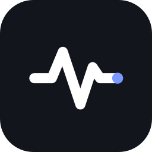
</p>

<h1 align="center">Pulse</h1>

<p align="center"><b>The AI community manager that learns.</b></p>

<p align="center">
  Answers your community from Notion in seconds, asks your organizers when it doesn't know and remembers their answer forever.<br/>
  It follows every upset member until they're sorted, and reaches you on your phone when a human is needed.<br/>
  Every action goes through <b>Swytchcode</b>.
</p>

<p align="center">
  
  
  
  
  
</p>

<p align="center">Build with Swytchcode · Gurgaon 2026 · <b>Track 3: AI Community Agent</b></p>

<p align="center">
  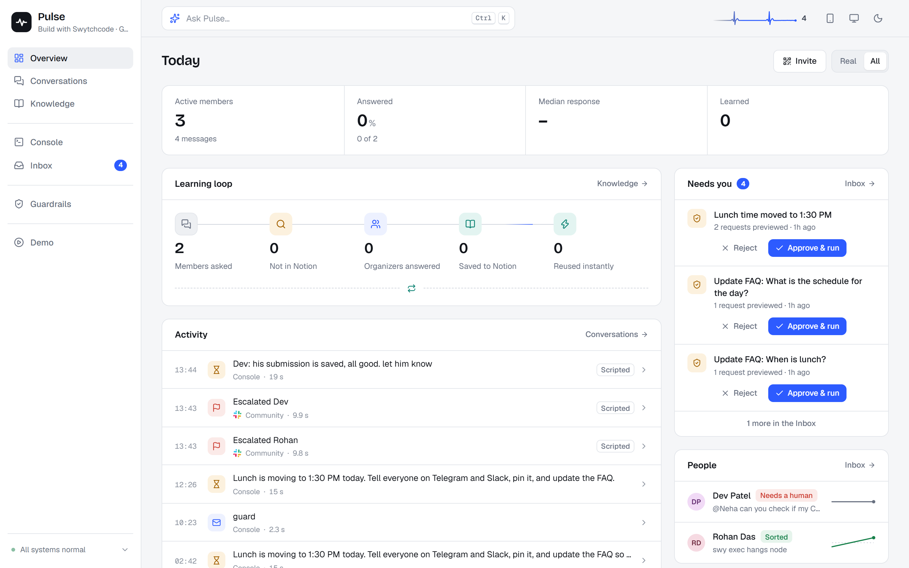
</p>

<table align="center">
  <tr>
    <td align="center">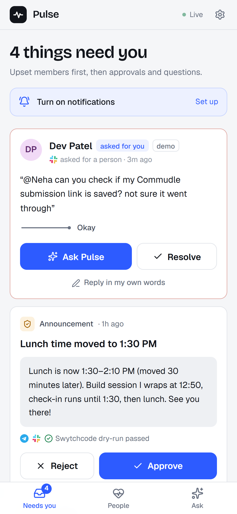<br/><sub><b>Needs you</b>: Ask Pulse, approve, resolve</sub></td>
    <td align="center">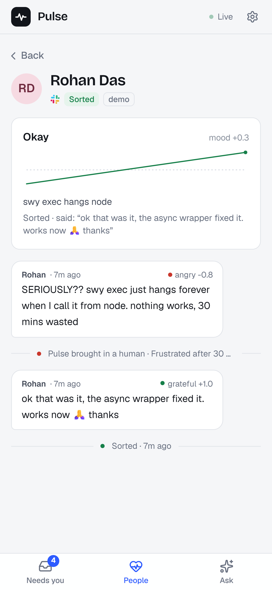<br/><sub><b>A member's story</b>: angry → human → sorted</sub></td>
    <td align="center">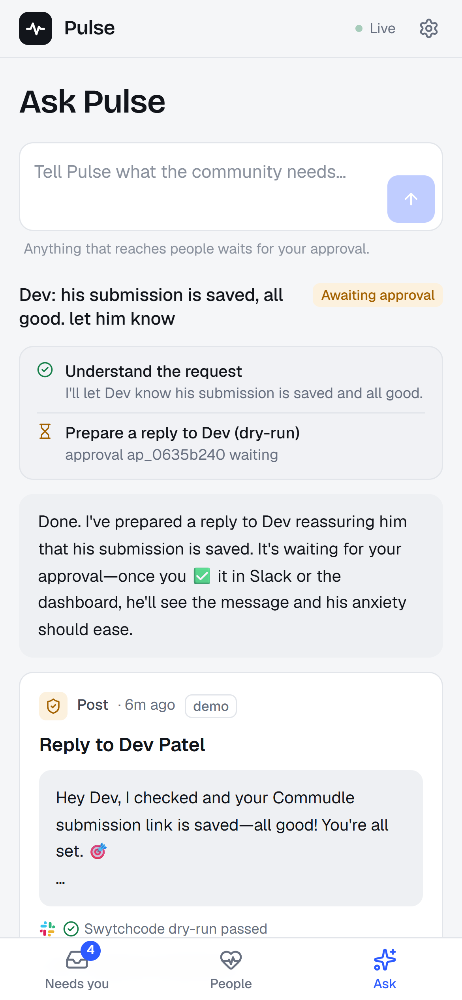<br/><sub><b>Ask Pulse</b>: the Console, in your pocket</sub></td>
  </tr>
</table>

Integrations: **Telegram · Slack · Notion · Resend**, all via Swytchcode. (X is the fifth Track 3 integration. We left it out because its API is paid-only since Feb 2026, and this project runs on free tiers.)

---

## The problem

Every community (a college club, an open-source project, a hackathon, a product's users) has the same three problems:

1. **The same questions, again and again.** Organizers burn out answering "when's the deadline?" for the 40th time.
2. **Knowledge lives in people's heads.** When a mod answers something in a chat, it's gone by next week.
3. **People fall through the cracks.** A frustrated newcomer's question scrolls away unanswered, and they leave.

## What Pulse does

| | |
|---|---|
| **Answers instantly** | Answers member questions in Telegram/Slack from the community's **Notion** knowledge base, with a link to the source page. |
| **Learns from organizers** | If a question isn't in Notion, Pulse tells the member it's checking and asks the organizers in a private Slack **#mods** thread. An organizer replies once. Pulse relays the answer, **writes it to Notion as a clean FAQ entry**, answers anyone else who was waiting, and answers instantly next time. |
| **Turns chat into knowledge** | When a member correctly answers another member, Pulse proposes saving it. An organizer reacts ✅ in Slack; it's saved to Notion and the helper is credited and thanked. |
| **Follows every problem until it's solved** | A fast mood model reads every message (−1 … +1, emotion, "is this a problem?", "is it solved?"; keywords are the fallback). A member who is stuck or upset gets a **case**: Pulse tracks their mood over time and brings in a human when the *trend* says so (very upset, getting worse, still stuck after Pulse's answer, asked 3 times, upset and waiting, or asked for a person), each with a plain-language reason. When they say *"works now, thanks"* the case closes itself and #mods is told in the same thread. |
| **Looks after people** | Welcomes newcomers and runs a **care sweep** that revives questions nobody answered. |
| **Reaches the organizer anywhere** | Everything that needs a human is **emailed** via Swytchcode → Resend (upset members within seconds, the rest bundled every few minutes) and **pushed to the organizer's phone**. The **Pulse phone app** (a PWA at `/m`) has Approve / Reject and Resolve right on the notification, lets you answer a question Pulse didn't know (it's relayed and saved to Notion, same learning loop as Slack), and handle an upset member: tell Pulse what to do in your own words (*"lunch is at 1:30 now, let him know"*); it drafts the reply in their thread (plus an FAQ fix or announcement only if you ask), you approve, it's sent through Swytchcode, taken off your list, and Pulse keeps watching until they're sorted. |
| **Operator Console** | Organizers type requests like *"Lunch moved to 1:30. Tell everyone, pin it, update the FAQ."* Pulse researches, plans and prepares every action as a **Swytchcode dry-run preview**, then executes after approval (dashboard click or ✅ in Slack). |
| **Digest** | The agent writes a digest (top questions, what it learned, knowledge gaps, top helpers, who needs attention), emails it via **Resend**, and archives it in Notion. |
| **Guardrails that can't be prompted away** | Swytchcode policies block secret leaks, @channel mass-pings, shortened or raw-IP links, emails to strangers, DMs to non-members and posting floods, **before the request leaves the machine**, whatever the model decides. |

Pulse is **an agent, not a pipeline**. Every event (a message batch, an organizer reply, a console request, a sweep) runs a tool loop in which the model chooses what to do: `search_knowledge`, `reply`, `welcome`, `ask_mods`, `flag_member`, `propose_knowledge`, `react`, `stay_silent`, or, in the console, `announce`, `create_poll`, `upsert_knowledge`, `send_email`, `find_capability → inspect_capability → run_capability`. Tool results drive the next step (a KB miss leads to `ask_mods`; an organizer's reply leads to a Notion write and a relay).

---

## Architecture

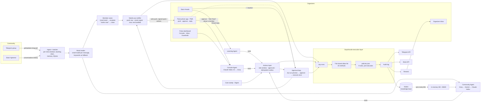

### The learning loop

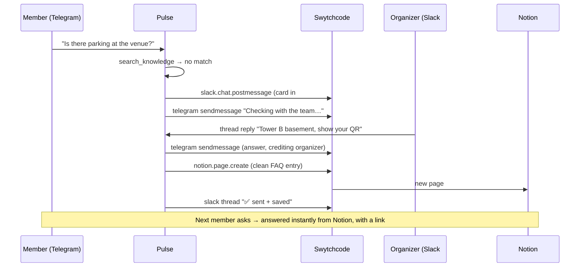

### Swytchcode usage

Pulse contains **no direct HTTP calls to Telegram, Slack, Notion or Resend**. It uses 34 allow-listed canonical methods, including:

| Provider | Methods (canonical ids) | Used for |
|---|---|---|
| Telegram | `getupdate`, `sendmessage`, `editmessagetext`, `sendchataction`, `getchatmember`, `pinchatmessage`, `sendpoll`, `getme`, … | listening (long-poll), replies, typing, membership checks for the DM policy, pinned announcements, polls |
| Slack | `conversations.history.list`, `conversations.reply.list`, `chat.postmessage.create`, `reactions.get.list`, `reactions.add.create`, `pins.add.create`, `users.info.list`, … | listening, #mods cards, ✅ approvals, thread replies from organizers, scripted personas (`username`/`icon_url`) |
| Notion | `databas.get`, `data_source.get/update`, `query.create`, `page.create`, `page.update` | knowledge-base schema setup, sync, learned answers, usage counts, digest archive |
| Resend | `email.create` (with `Idempotency-Key`) | digest and organizer emails |

It also uses these Swytchcode features:
- **Allow-list (fail-closed).** Anything else returns `not_found`; the self-test proves it.
- **Policies** (`guardrails.config.ts` compiles to `policies.json`). Dynamic state from API output (cooldown chats, verified members) is recompiled live.
- **Dry-run previews.** Every approval card shows the exact HTTP request Swytchcode would send, with auth redacted.
- **Audit log.** Every call appears in the dashboard's Guardrails screen.
- **Discover and info at runtime.** The Console's `find_capability` / `inspect_capability` let the agent use any allow-listed method with no new code.
- **Execution policy.** Retries only on 429 for posts (never double-post) and idempotency keys for email.

Why Pulse runs its own approval loop: Swytchcode's `REQUIRES_APPROVAL` needs the Business plan. Pulse builds the equivalent through Swytchcode itself: dry-run, then a Slack ✅ or dashboard click, then a single execution.

---

## The dashboard

| Screen | What it's for |
|---|---|
| **Overview** | Active members, questions answered, median response time, answers learned, and the live activity feed (click any decision for its full trace) |
| **Console** | Type a request and watch the plan, each tool, each Swytchcode call, the dry-run previews and approvals, then the result |
| **Conversations** | Telegram and Slack as Pulse sees them, each message annotated with Pulse's decision (answered, asked organizers, stayed silent, flagged) |
| **Knowledge** | The Notion knowledge base: entries, where each was learned, how often it's used, gaps waiting on organizers |
| **Inbox** | Approvals with previews, questions waiting on organizers, members needing attention |
| **Guardrails** | Policies with block counts, live blocked attempts, the 18-check self-test, the allow-list, and the audit log |
| **Demo** | Scripted scenarios (fake members, real agent) with play, pause, speed and reset |

<table>
  <tr>
    <td>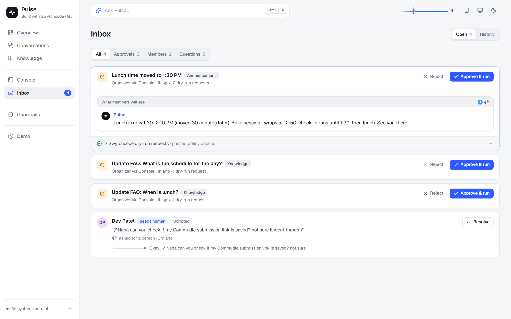<br/><sub><b>Inbox</b>: approvals with Swytchcode dry-run previews, members with their mood line</sub></td>
    <td>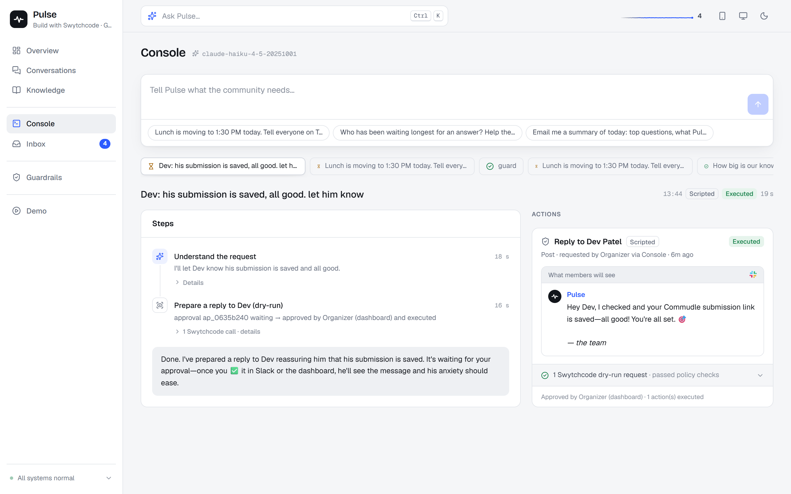<br/><sub><b>Console</b>: plain-English request → steps → approvals</sub></td>
  </tr>
  <tr>
    <td>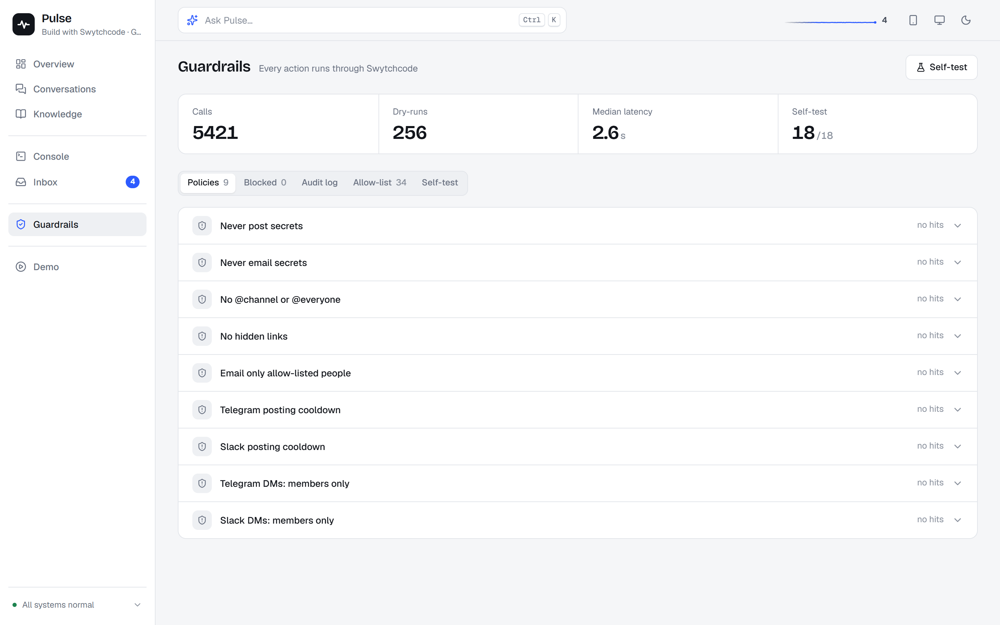<br/><sub><b>Guardrails</b>: Swytchcode policies, blocked attempts, self-test, audit</sub></td>
    <td>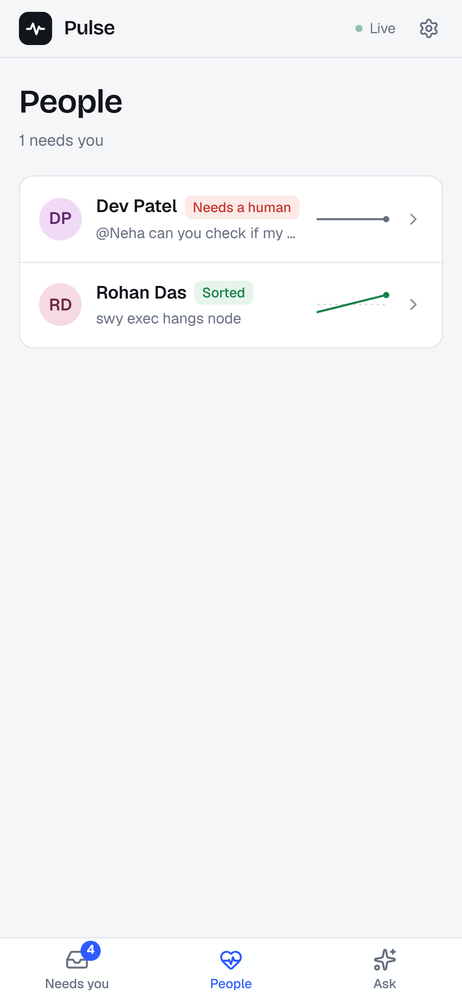<br/><sub><b>People</b> (phone): who's stuck, who's sorted</sub></td>
  </tr>
</table>

**On your phone (`/m`).** Tap the phone icon in the dashboard's top bar and scan the QR. It opens the app over a Cloudflare tunnel with your access token, so you can add it to the home screen and turn on notifications. Screens: **Needs you** (approve, answer, reply, resolve), **People** (everyone Pulse is following, with a mood line and the full story), **Ask** (the Console).

---

## Setup

Requirements: Node ≥ 22.13 and the Swytchcode CLI (`npm i` installs it locally).

```bash
npm install
cp .env.example .env          # fill in keys (see comments in the file)
npm run setup:notion          # shapes your Notion database into the knowledge base
npm run seed:kb               # optional: seeds the demo community's FAQ
npm run selftest              # proves all guardrails are live (18 checks)
npm run build && npm start    # dashboard on http://localhost:3210
```

**Accounts** (all free tiers):
- **Telegram:** create a bot with @BotFather, add it to your group as an admin, and put the token and group id in `.env`.
- **Slack:** create an app with the bot scopes listed in `.env.example`, install it, `/invite @Pulse` into your community channel and a private `#mods` channel, and put the channel ids in `.env`.
- **Notion:** create an internal integration, add it to your database (••• → Connections), and put the token and database id in `.env`.
- **Resend:** add an API key and your own address as `DIGEST_TO`.
- **LLMs:** a Groq key (fast community replies), plus Anthropic (the Console runs on Claude Haiku 4.5 first).
- **Phone app (optional):** install `cloudflared` and set `TUNNEL=cloudflared`. Pulse opens a free HTTPS tunnel, generates an access token (requests from the laptop itself stay trusted), and shows the pairing QR under the phone icon. `npx tsx scripts/make-icons.ts` regenerates the app icons.

Development: `npm run dev` (server with reload) and `npm run dev:web` (Vite on :5173, proxies `/api`).

Tests: `npm test`. There are 114 tests covering the mood reader, the case rules and the organizer notifier, plus the Swytchcode wrapper against the real binary, the policies compiler (golden files), the idempotent outbox, the batcher, the approval state machine and community-agent tool routing (scripted model).

---

## Design notes

- **Speed.** Community replies run on Groq (about 0.7 s per step) with per-step fallback to Gemini, then Claude. A 3 s batching window merges fragmented messages ("hey" / "how do I…" / "with the SDK") into one answer.
- **Knowledge as context, not RAG infrastructure.** The KB is small, so the best BM25 matches go straight into the prompt. Notion stays the source of truth, and organizers can edit it directly.
- **Never double-post.** Every outbound message goes through an outbox keyed by chat, reply target and text (or by approval id + action index). A crash mid-send is quarantined, never retried.
- **Honest numbers.** Scripted demo traffic is flagged end to end and counted separately from real members.
- **Escalation by trend, not by one angry word.** The mood model only scores; the escalation rules are code (`src/core/cases.ts`), so every "needs a human" has a reason you can read and test.
- **Phone actions without a password on the phone's notifications.** Each push carries an HMAC signature valid for that one item only, so the service worker can Approve/Resolve without storing the access token. Email buttons only open the app; email scanners that prefetch links can't approve anything.
- **Stored state.** SQLite (`node:sqlite`) for messages, runs, approvals and pending questions; Notion for knowledge.

Project layout:
```
src/agent/      community, learn, console agents · prompts · model chains
src/core/       channels (guarded posting), approvals, mods, runs, stats
src/kb/         Notion knowledge base + sync
src/jobs/       care sweep, digest
src/demo/       scripted personas + scenario engine
src/swy/        Swytchcode wrapper, policies compiler, self-test
src/server/     Hono API + SSE, state aggregator
web/            React dashboard (7 screens)
```
